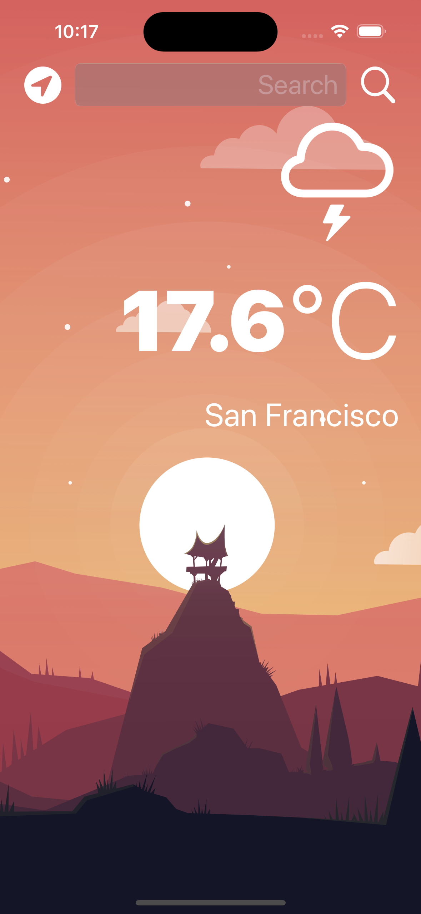
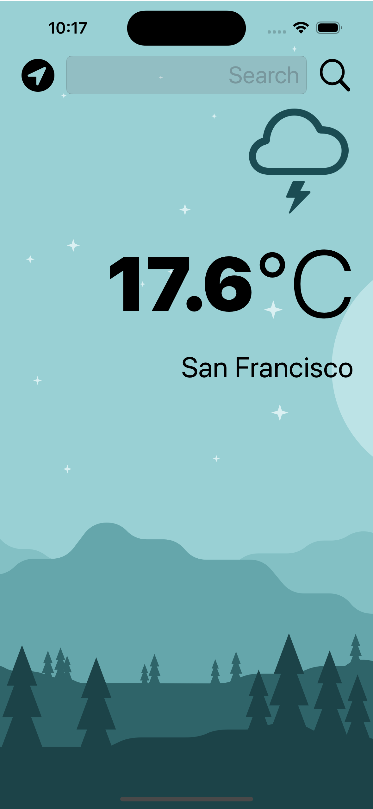

# Clima

## Resume

Swift application using :
- Dark mode / light mode
- Communication with an API
- JSON serialization and deserialization
- Core Location
- Protocols
- Delegate patern
- Extension methods

  
  

